# How Cedar Clerk's documentation is organized

A diagram of the flows between documents: who is the primary source, what moves where, and at what point. It exists so desynchronization doesn't repeat itself — like BACKLOG considering a feature open, ROADMAP calling it "not started", while the code has had it since last week.

## Diagram

```mermaid
flowchart TB
    subgraph SRC["Primary sources — truth is born here"]
        OWNER(["Owner: by voice, in chat"])
        INPUTP["docs/INPUT_PROMPT.md<br/><i>in docs/, outside git</i><br/>dynamic prompt inbox"]
        CODE["Code + git log<br/><i>what actually works</i>"]
    end

    subgraph PLAN["Planning — what we're doing"]
        BACKLOG["docs/tasks/BACKLOG.md<br/><b>task board</b><br/>OPEN items only<br/>ID · Name · Priority · Tags · Description"]
        TASKS["docs/tasks/TASKS.md<br/><b>currently in progress</b><br/>short horizon"]
    end

    subgraph WHY["Rationale — why exactly this way"]
        DECISIONS["docs/DECISIONS.md<br/><b>ADR log: index</b><br/>full text — docs/adr/, one file per ADR"]
        RULES[".claude/rules/*.md<br/><b>hard rules</b><br/>what has already broken"]
        PRODENV[".claude/rules/production-environment.md<br/><b>truth about production</b><br/>rewritten from the live machine"]
        CLAUDE["CLAUDE.md<br/>how to work with me"]
    end

    subgraph REF["References — how things actually are"]
        PRODUCT["docs/product/PRODUCT.md<br/>product, target audience, pricing"]
        PRD["docs/product/PRD.md<br/>requirements"]
        ARCH["docs/tech/ARCHITECTURE.md<br/>system design"]
        QA["docs/tech/QA.md<br/>permanent verification checklist<br/>by surface, re-checked on change"]
        DESIGN["docs/design/DESIGN.md<br/>tokens, UI patterns"]
        UIINV["docs/design/UI-INVENTORY.md<br/>inventory of UI elements"]
        STACK["docs/knowledge_base/STACK.md<br/>stack and costs"]
        BIZ["docs/product/BUSINESS.md<br/>money: gates, metrics, rituals"]
        COMPET["docs/product/COMPETITORS.md<br/>competitor landscape:<br/>per segment, take / refuse"]
        METRICS["docs/product/METRICS.md<br/>event dictionary, metrics derivation §4"]
        MULTI["docs/product/MULTITENANCY.md<br/>what happens once there are users"]
        LEGAL["Terms + Privacy<br/>/terms, /privacy — Angular components<br/>filled in 13.08, not reviewed by a lawyer"]
    end

    subgraph USR["docs/for_user — instructions and manuals"]
        INTEG["docs/for_user/integrations-setup.md<br/>provider-key setup runbook"]
    end

    subgraph MOD["Indie-gamedev module — Phase 13"]
        INDIE["docs/product/INDIEDEV.md<br/><b>module scope</b><br/>MUST / MIGHT, data model"]
        DESKTOP["docs/tech/DESKTOP.md<br/>how the desktop build works"]
        DPROMPT["docs/design/indiedev-design-prompt.md<br/>brief for Claude Design"]
        UIV2["docs/design/UI-V2-PLAN.md<br/>plan for the port to Cedar Bench"]
        RPROMPT["docs/design/bench-responsive-prompt.md<br/>brief for Claude Design:<br/>Cedar Bench narrow screens"]
        BPROMPT["docs/design/bench-board-prompt.md<br/>brief for Claude Design:<br/>fourth screen — task board"]
        PAPER["docs/design/paper-first/BRIEF.md<br/>Paper first: the direction after Cedar Bench<br/>+ docs/design/paper-first/CONTRACT.md<br/>the frozen build contract (ADR-239)"]
    end

    CHANGELOG["docs/tasks/CHANGELOG.md<br/><b>session history</b><br/>human-readable, by date"]

    OWNER -->|"writes it himself"| INPUTP
    OWNER -->|"says it in session"| BACKLOG
    INPUTP -->|"Input sweep:<br/>checked against code → board"| BACKLOG

    BACKLOG -->|"taken into work →<br/>row is DELETED from here"| TASKS
    TASKS -->|"done, session summary"| CHANGELOG
    TASKS -->|"a check that outlives its sprint"| QA

    BACKLOG -.->|"a Q-xx question needs<br/>the owner's decision"| OWNER

    TASKS ==>|"BEFORE the code:<br/>the decision gets written down"| DECISIONS
    DECISIONS ==>|"only after that"| CODE
    CODE -->|"broke painfully →<br/>becomes a rule"| RULES
    CODE -->|"prod: read off the machine,<br/>not from memory (11.08)"| PRODENV
    RULES -.->|"read before<br/>working in that area"| DECISIONS

    CODE -.->|"check: are the docs lying?"| CHANGELOG
    CODE -.->|"check"| BACKLOG

    ARCH -.->|"read BEFORE<br/>any implementation"| DECISIONS
    PRD -.->|"same"| DECISIONS
    PRODUCT -->|"who for and why"| BACKLOG
    COMPET -->|"what to take / refuse →<br/>board rows, anti-features"| BACKLOG
    DESIGN --> UIINV
    LEGAL -.->|"lawyer before opening<br/>registration — gate §1"| BIZ
    BIZ -->|"§4: which metrics matter →<br/>how they're computed (ADR-126)"| METRICS

    CODE -->|"UI changed →<br/>update it"| UIINV
    CODE -->|"the design changed"| ARCH

    DECISIONS -->|"ADR-101…107<br/>module decisions"| INDIE
    INDIE -->|"rows T-120…T-137"| BACKLOG
    UIV2 ==>|"every decision —<br/>an ADR first"| DECISIONS
    UIV2 -->|"rows T-205…T-235"| BACKLOG
    INDIE --> DESKTOP
    DESIGN -->|"token rules; values —<br/>from styles.scss before each run"| DPROMPT
    INDIE -->|"which screens are needed"| DPROMPT
    UIV2 -->|"what the kits don't answer:<br/>chrome at narrow widths"| RPROMPT
    DESIGN -->|"the same token rules;<br/>values — before each run"| RPROMPT
    RPROMPT -->|"when the screens arrive —<br/>rows T-236…T-237"| BACKLOG
    UIV2 -->|"what the kits don't answer:<br/>no task board in the set"| BPROMPT
    DESIGN -->|"the same token rules;<br/>values — before each run"| BPROMPT
    BPROMPT -->|"when the screen arrives —<br/>row T-229"| BACKLOG

    classDef source fill:#5B6E46,stroke:#3E4A2F,color:#fff
    classDef plan fill:#E8E3D6,stroke:#B8B0A0,color:#26231D
    classDef why fill:#B4452C,stroke:#8A331F,color:#fff
    classDef ref fill:#F7F5EF,stroke:#DBD5C8,color:#26231D
    classDef mod fill:#C98A3B,stroke:#8A5D1F,color:#fff
    class OWNER,INPUTP,CODE source
    class BACKLOG,TASKS,CHANGELOG plan
    class DECISIONS,RULES,PRODENV,CLAUDE why
    class PRODUCT,PRD,ARCH,QA,DESIGN,UIINV,STACK,BIZ,COMPET,METRICS,MULTI,INTEG,LEGAL ref
    class INDIE,DESKTOP,DPROMPT,UIV2,RPROMPT,BPROMPT mod
```

**Edge legend** (introduced 18.08.2026 — before that the three types read the same): **solid `-->`** — flow of truth: content or a fact moves along the arrow; **thick `==>`** — a hard gate, can't be skipped (ADR first — only then code); **dotted `-.->`** — a check or reading order: nothing moves, the arrow says "look there before/after".

## Primary sources (truth is born only here)

| Source | What it holds | What matters |
|---|---|---|
| **Owner** | All the wants and priorities | The only source of goals. Questions for him pile up in BACKLOG as `Q-xx` |
| **`docs/INPUT_PROMPT.md`** | Dynamic prompt inbox (appeared 18.08.2026): "considered as a new prompt every time" — whole brief documents, scopes, session assignments | **The only inbox** (the old out-of-repo `Input.md` was retired 18.08.2026) and **not committed** (in `.gitignore`) — the owner periodically rewrites the whole file; the moment of the rewrite is recovered from mtime against the last "Input sweep" in `docs/tasks/CHANGELOG.md`. Processing: check against the code (briefs can be older than the code) → board, an "Input sweep" entry logged in CHANGELOG. The content can be stale — read the date inside the document before the document itself |
| **Code + `git log`** | What actually works | **The final arbiter.** If a doc and the code disagree, the code is right and the doc gets fixed |

## Planning

**`docs/tasks/BACKLOG.md` — the task board.** Open items only. Format: `ID · Name · Priority · Tags · Description`, IDs are stable (`T-xxx` tasks, `Q-xx` questions), the owner's original numbers (B*, N*, I*, NF*, FI*) go in parentheses in the description. **Done rows are deleted**, not struck through: history lives in git, and the board has to read in a minute.

**`docs/tasks/TASKS.md` — short horizon.** What's being worked on right now + a "not verified live" checklist, plus a **Notes** section with the current version in production and the active branch — the fastest place to see "what's happening right now." The fastest-staling file. Don't create a copy in the repo root: the Cowtext board looks for the file there first, and a root copy would shadow the real one.

**`docs/tasks/CHANGELOG.md` — by date, human-readable.** Written at the end of a session. Until 24.08.2026 phase status was duplicated in a separate `ROADMAP.md` — that file was retired as an almost-duplicate of this log, and the phase 0–13 history it carried went with the archive clear-out.

## Rationale

**`docs/DECISIONS.md` (ADR log)** — a hard rule from AGENTS.md: **change a decision → ADR first, then code.** Superseded decisions aren't erased, they're overridden by a new ADR (e.g. ADR-065 corrects ADR-064) — so you can see not just "how it is" but also "how we thought before and why we changed our mind." **Since 18.08.2026 the log has been split**: full text — one file per ADR in `docs/adr/`, `DECISIONS.md` — an index that all the old links still point to; a new ADR = a new file + an index row.

**`.claude/rules/*.md`** — things that have already broken painfully: the Telegram bot, EF migrations, renderers, destructive operations, secrets, production. Read **before** working in that area.

## Three rules against desynchronization

1. **A task lives in exactly one place.** Open → BACKLOG. Taken → TASKS. Done → CHANGELOG, **delete** from BACKLOG.
2. **Before implementation — ARCHITECTURE and PRD; when changing a decision — DECISIONS first.**
3. **Don't trust a doc's status claim — check it against the code.** That's how these were found: the admin panel, listed as "not started" for months while it had been ready since 27.07; `I15`, closed but still hanging open; `N6`/`N11`, done before they were even filed.

## Indie-gamedev module (Phase 13, since 10.08.2026)

Three new documents don't change the rules above — they occupy specific places within them:

- **`docs/product/INDIEDEV.md`** — the module reference: scope, data model, MUST/MIGHT. Read **before** implementing any `T-120…T-137` row, exactly like `ARCHITECTURE.md` and `PRD.md` under rule 2.
- **`docs/tech/DESKTOP.md`** — how the desktop build works. A separate file rather than a section of `ARCHITECTURE.md`, because it describes a second runtime environment with its own risks; `ARCHITECTURE.md` links to it.
- **`docs/design/UI-V2-PLAN.md`** — the plan for porting the frontend to the Cedar Bench design system. Lives only on the `UI_V2` branch, the source of truth for the duration of the port; as ADRs get written, each of its decisions moves into `docs/adr/`, and the document dies off. The design system itself is mirrored from Claude Design into `.design-sync/ds-v2/` — outside `docs/`, because it's a pulled-down cache, not a document.
- **`docs/design/indiedev-design-prompt.md`** — a brief for Claude Design. A one-way consumer: tokens are copied into it verbatim from `DESIGN.md`, nothing flows back. **Which means it goes stale silently** — check it against `styles.scss` before each run whenever that file changes.
- **`docs/design/bench-responsive-prompt.md`** — a second brief for Claude Design, per ADR-147: Cedar Bench narrow screens. The same one-way type as the brief above, and for the same reason **carries no verbatim token block** — only an "insert before each run" note pointing at `styles.scss`. It differs in subject: it doesn't ask for a set of new screens, but for how the chrome (rail, pegboard, shelves, drawer, ruler) behaves below desktop width, plus the density contract under a coarse pointer and the breakpoints themselves. Until it's answered, `T-034` can't be closed, and the port branch deliberately lives without a single width-based `@media`.
- **`docs/design/bench-board-prompt.md`** — a third brief for Claude Design, per ADR-165: the fourth reference screen, the task board. The same one-way type, and likewise carries no verbatim token block. A separate file rather than a section in the brief above, because the subject is different: not how existing screens behave at narrow widths, but a screen that isn't in the set at all, at desktop width — running both through one pass would produce answers that couldn't be accepted or rejected separately. Until it's answered, `T-229` can't be closed, and `project-tasks` lives on workbench materials with its own earlier geometry.
- **`docs/design/paper-first/BRIEF.md`** — the maintainer's ruling on Cedar Bench's chrome and the direction that replaces it; the eight artboards beside it (`*.dc.html`, rendered `*.png`) are the drawing. **`docs/design/paper-first/CONTRACT.md`** — the build contract frozen from that brief by ADR-239: component APIs, the global CSS vocabulary, file zones for the four build lanes, the interfaces between them, acceptance and order of battle. Both are read by every lane of the port and edited by the tech lead only; when the port lands, the contract's living parts move into `DESIGN.md` and `UI-INVENTORY.md`, and the folder stays as the record of the drawing.

The rule "a task lives in exactly one place" applies here too: the MUST/MIGHT lists in `INDIEDEV.md` are the module's *composition*, while the task rows live in `BACKLOG.md`. The list in `INDIEDEV.md` isn't struck through as work proceeds — status is tracked by `docs/tasks/CHANGELOG.md`.

## File placement (taxonomy, 18.08.2026)

The `docs/` root holds only high-level material: `DOCS-FLOW.md` (this map), `DECISIONS.md` (the ADR index — the path is deliberately stable: ~40 files link to it, half of them from code) and the untracked `INPUT_PROMPT.md` (by the owner's rule — in the root). Everything else is sorted into subcategories:

| Folder | What goes there | Currently there |
|---|---|---|
| **`product/`** | The highest-level product context: the product as a whole, the business model, requirements | PRODUCT, PRD, BUSINESS, METRICS, MULTITENANCY, INDIEDEV, COMPETITORS |
| **`tasks/`** | Everything related to tasks | TASKS (short horizon), BACKLOG (board), CHANGELOG (history by date) |
| **`design/`** | Design, UI, UX | DESIGN (tokens), UI-INVENTORY, UI-V2-PLAN, indiedev-design-prompt, bench-responsive-prompt, bench-board-prompt |
| **`tech/`** | The technical side | ARCHITECTURE, DESKTOP, QA |
| **`adr/`** | Decision texts, one file per ADR (+ ownership-audit) | 205 ADRs. The index is in the root; its own folder rather than `tech/adr/`, because ADRs can be product decisions (ADR-092, ADR-101) as well as technical ones |
| **`fleet/`** | Agent orchestration (Cowtext / FleetView) | so far only `docs/fleet/README.md` — agent definitions live in `.claude/agents/` |
| **`knowledge_base/`** | Knowledge base: terminology, technologies and stack, localization tables, lists of shipped features | STACK; `docs/knowledge_base/TERMINOLOGY.md` (project terminology dictionary, extracted from the code on 18.08.2026) |
| **`for_user/`** | All instructions, manuals and everything else that matters to the user | integrations-setup (provider runbook) |
| **`archive/`** | Archive of old .md files — lives in the repo, **text isn't edited** (a record of a moment), periodically cleared out wholesale (24.08.2026: the DO-migration log, ROADMAP phases 0–10 and the docs audit — deleted as having served their purpose) | `incidents.md` — the index of every recorded incident: what broke, where the narrative lives, what guards it now. It is an index into living records rather than a record of a moment, so it is maintained, not frozen |
| **`misc/`** | Everything else | the folder will appear with the first file that doesn't fit anywhere above |

A new doc must get a node in the diagram above **in the same commit** — STACK/BUSINESS/MULTITENANCY were once not entered at all, and that was found only by an audit (18.08).

**Absolute local paths, drive letters and paths to out-of-repo folders are not mentioned in documentation** (rule from 18.08.2026): example paths are written without a drive (`MyGame/Assets`); portable forms (`%APPDATA%\…`) and droplet paths (`/home/martycow/…`) are fine. Out-of-repo material (briefs, design packages, notes) is referenced descriptively — "the owner's out-of-repo brief," a filename without a path; only he knows where they live.

## Operations console

`docs/for_user/operations-console.md` documents installation, JSON program profiles, commands and verification of the Rust console (ADR-252).

## Known weak spots

- **`docs/product/PRD.md` tends to lag behind the other references more than most** — fixed on 10.08 (languages) and again on 18.08 (Phase 13 was listed "open" while MUST was closed, "six" languages while the code had nine, payments "not yet live" while Stripe had been verified with real money). Check it against the code at every large review — don't trust status claims without the code.
- **`docs/design/UI-INVENTORY.md`** is updated by hand; since 12.08.2026 `UiInventoryDriftTests` catches coarse drift (a screen with not a single mention = a red `dotnet test`), but the guard can't check the accuracy of individual *rows*. The module's screens are entered (the last two — `projects`/`project`, 18.08.2026).
- **The inbox is invisible in git history** — `docs/INPUT_PROMPT.md` is deliberately not committed (rule: "no need to commit it"), so the moment of a rewrite can only be recovered from mtime against the last "Input sweep" in `docs/tasks/CHANGELOG.md`. The old out-of-repo inboxes (`Input.md`, the `Gamedev_Focused_Rework.md` brief) were retired 18.08.2026 — mentions of them in history remain a record of that time.
- ~~**`docs/design/indiedev-design-prompt.md` duplicates tokens**~~ — **fixed 18.08.2026**: the verbatim block of values was replaced with a pointer to `styles.scss` after the duplicate had drifted out of sync with the code (font roles and icon sizes shifted on 01.08, the brief was left with the old ones).
- **The archive gets cleaned without warning** — found 24.08.2026: three files in `docs/archive/` (the DO-migration checklist, ROADMAP-phases-0-10, and the docs audit) were deleted with the commit message «Removed outdated docs», and references to them in this map and in `.claude/rules/production-environment.md` were left dangling — `DocsFlowGraphTests.Every_mapped_path_exists` caught it only now, not at deletion time, because the test wasn't run between commits. If a file under `archive/` has gone missing, check `git log --diff-filter=D -- docs/archive/` before fixing the references.

## Prod move to DigitalOcean (11.08.2026) — history with no living checklist

The checklist for moving production from the Raspberry Pi to DigitalOcean, taken from the machine's actual state, lived in the archive under the name `migration-to-digitalocean.md` and was deleted 24.08.2026 in the archive cleanup (see the point above) — the fact of the move and its outcome remain in `docs/tasks/CHANGELOG.md`/`docs/DECISIONS.md` as a record of that moment. The source of truth for production's current state is `.claude/rules/production-environment.md`, rewritten from the live machine's actual state on 11.08.2026.
