# How Cedar Clerk's documentation is organized

This repo runs the Moo.exe pipeline (`Docs_AI/Pipeline.md`: capture, decide, implement, review, close, publish) under its own file names. The map below shows which document is the primary source, what moves where, and when. It exists so a feature never reads "open" in the board and "not started" in a roadmap while the code has had it for a week.

## Diagram

```mermaid
flowchart TB
    subgraph SRC["Primary sources — truth is born here"]
        OWNER(["Owner: by voice, in chat"])
        INPUTP["docs/INPUT_PROMPT.md<br/><i>in docs/, outside git</i><br/>the inbox"]
        CODE["Code + git log<br/><i>what actually works</i>"]
    end

    subgraph PLAN["Planning — what we're doing"]
        BACKLOG["docs/tasks/BACKLOG.md<br/><b>task board</b><br/>OPEN items only<br/>ID · Name · Priority · Tags · Description"]
        TASKS["docs/tasks/TASKS.md<br/><b>in progress now</b><br/>short horizon"]
    end

    subgraph WHY["Rationale — why exactly this way"]
        DECISIONS["docs/DECISIONS.md<br/><b>ADR log: index</b><br/>full text — docs/adr/, one file per ADR"]
        RULES[".claude/rules/*.md<br/><b>hard rules</b><br/>what has already broken"]
        PRODENV[".claude/rules/production-environment.md<br/><b>truth about production</b><br/>rewritten from the live machine"]
        CLAUDE["CLAUDE.md<br/>how to work with me"]
    end

    subgraph REF["References — how things actually are"]
        PRODUCT["docs/product/PRODUCT.md<br/>product, target audience, pricing"]
        PRD["docs/product/PRD.md<br/>requirements"]
        ARCH["docs/tech/ARCHITECTURE.md<br/>system design"]
        LOCALIZATION["docs/tech/LOCALIZATION.md<br/>language resources and ownership"]
        QA["docs/tech/QA.md<br/>permanent verification checklist<br/>by surface, re-checked on change"]
        SEC["docs/tech/SECURITY.md<br/>threat model: assets, boundaries,<br/>STRIDE table, gaps"]
        DESIGN["docs/design/DESIGN.md<br/>tokens, UI patterns"]
        UIINV["docs/design/UI-INVENTORY.md<br/>inventory of UI elements"]
        STACK["docs/knowledge_base/STACK.md<br/>stack and costs"]
        RESEARCH["docs/knowledge_base/RESEARCH-2026-09.md<br/>API research: IndieDB, LinkedIn,<br/>IGDB, Telegram comments, events"]
        BIZ["docs/product/BUSINESS.md<br/>money: gates, metrics, rituals"]
        COMPET["docs/product/COMPETITORS.md<br/>competitor landscape:<br/>per segment, take / refuse"]
        METRICS["docs/product/METRICS.md<br/>event dictionary, metrics derivation §4"]
        MULTI["docs/product/MULTITENANCY.md<br/>what happens once there are users"]
        LEGAL["Terms + Privacy<br/>/terms, /privacy — Angular components<br/>not yet reviewed by a lawyer"]
    end

    subgraph USR["docs/for_user — instructions and manuals"]
        INTEG["docs/for_user/integrations-setup.md<br/>provider-key setup runbook"]
        DEPLOY["docs/for_user/deploy.md<br/>Bash deployment, prerequisites and recovery"]
        DESKTOPBUILD["docs/for_user/desktop-build.md<br/>Windows, macOS and Linux builds"]
    end

    subgraph MOD["Indie-gamedev module — Phase 13"]
        INDIE["docs/product/INDIEDEV.md<br/><b>module scope</b><br/>MUST / MIGHT, data model"]
        DESKTOP["docs/tech/DESKTOP.md<br/>how the desktop build works"]
        PAPER["docs/design/paper-first/BRIEF.md<br/>Paper first: the direction after Cedar Bench<br/>+ docs/design/paper-first/CONTRACT.md<br/>the frozen build contract (ADR-239)"]
    end

    CHANGELOG["docs/tasks/CHANGELOG.md<br/><b>shipped history</b><br/>human-readable, by date"]

    subgraph REC["Pipeline records — one file per event"]
        BRIEFS["docs/briefs/BR-xxx.md<br/>one per working session"]
        REVS["docs/reviews/REV-xxx_name.md<br/>independent review by another model"]
        TPL["docs/templates/<br/>ADR · BR · REV · MAN masters<br/>copied from Docs_AI/Templates"]
    end

    OWNER -->|"writes it himself"| INPUTP
    OWNER -->|"says it in session"| BACKLOG
    INPUTP -->|"Input sweep:<br/>checked against code → board"| BACKLOG

    BACKLOG -->|"taken into work →<br/>row is DELETED from here"| TASKS
    TASKS -->|"done, session summary"| CHANGELOG
    TASKS -->|"a check that outlives its sprint"| QA

    BACKLOG -.->|"a Q-xx question needs<br/>the owner's decision"| OWNER

    TASKS ==>|"BEFORE the code:<br/>the decision gets written down"| DECISIONS
    DECISIONS ==>|"only after that"| CODE
    CODE -->|"broke painfully →<br/>becomes a rule"| RULES
    CODE -->|"prod: read off the machine,<br/>not from memory"| PRODENV
    RULES -.->|"read before<br/>working in that area"| DECISIONS

    CODE -.->|"check: are the docs lying?"| CHANGELOG
    CODE -.->|"check"| BACKLOG

    ARCH -.->|"read BEFORE<br/>any implementation"| DECISIONS
    ARCH --> LOCALIZATION
    PRD -.->|"same"| DECISIONS
    PRODUCT -->|"who for and why"| BACKLOG
    COMPET -->|"what to take / refuse →<br/>board rows, anti-features"| BACKLOG
    DESIGN --> UIINV
    LEGAL -.->|"lawyer before opening<br/>registration — gate §1"| BIZ
    BIZ -->|"§4: which metrics matter →<br/>how they're computed (ADR-126)"| METRICS

    CODE -->|"UI changed →<br/>update it"| UIINV
    CODE -->|"the design changed"| ARCH

    TPL -.->|"copy, never fill in place"| DECISIONS
    TPL -.-> BRIEFS
    TPL -.-> REVS
    TASKS -->|"session end"| BRIEFS
    BRIEFS -.->|"next session reads<br/>the latest first"| TASKS
    REVS -->|"input, not tasks:<br/>owner accepts findings → rows"| BACKLOG
    CODE -->|"reviewed by the other model"| REVS

    DECISIONS -->|"ADR-101…107<br/>module decisions"| INDIE
    INDIE -->|"rows T-120…T-137"| BACKLOG
    INDIE --> DESKTOP
    DESKTOP --> DESKTOPBUILD

    classDef source fill:#5B6E46,stroke:#3E4A2F,color:#fff
    classDef plan fill:#E8E3D6,stroke:#B8B0A0,color:#26231D
    classDef why fill:#B4452C,stroke:#8A331F,color:#fff
    classDef ref fill:#F7F5EF,stroke:#DBD5C8,color:#26231D
    classDef mod fill:#C98A3B,stroke:#8A5D1F,color:#fff
    class OWNER,INPUTP,CODE source
    class BRIEFS,REVS,TPL plan
    class BACKLOG,TASKS,CHANGELOG plan
    class DECISIONS,RULES,PRODENV,CLAUDE why
    class PRODUCT,PRD,ARCH,QA,SEC,DESIGN,UIINV,STACK,RESEARCH,BIZ,COMPET,METRICS,MULTI,INTEG,DESKTOPBUILD,LEGAL ref
    class INDIE,DESKTOP mod
```

**Edges.** Solid `-->`: content or a fact moves along the arrow. Thick `==>`: a hard gate (ADR first, only then code). Dotted `-.->`: a check or reading order; nothing moves.

## Pipeline mapping

| Pipeline stage | Pipeline name | Here |
|---|---|---|
| 0 Capture | `INBOX.md` | `docs/INPUT_PROMPT.md` (untracked) |
| 4 Decide | `ADR-xxx`, `BR-xxx`, `DECISIONS.md` | `docs/adr/`, `docs/briefs/`, `docs/DECISIONS.md` |
| 4 Tasks | `BACKLOG.md` | `docs/tasks/BACKLOG.md` (`T-xxx`, `Q-xx`) |
| 5 Implement | `TASKS.md` | `docs/tasks/TASKS.md` |
| 6 Review | `REV-xxx` | `docs/reviews/` |
| 7 Close | `CHANGELOG.md` | `docs/tasks/CHANGELOG.md` |
| Manuals | `docs/manuals/` | `docs/for_user/` |
| Glossary | `docs/glossary/` | `docs/knowledge_base/TERMINOLOGY.md` |
| Product / tech | `docs/product/`, `docs/tech/` | same |

Identifiers: `ADR-xxx`, `T-xxx` and `Q-xx` are the project's own and continue their counters. `BR-xxx` and `REV-xxx` start at 001. Numbers are never reused.

## Primary sources

| Source | What it holds | What matters |
|---|---|---|
| **Owner** | All goals and priorities | The only source of goals. Questions for him pile up in BACKLOG as `Q-xx` |
| **`docs/INPUT_PROMPT.md`** | The inbox: whole brief documents, scopes, session assignments | Gitignored; the owner rewrites the whole file. Recover the moment of a rewrite from its mtime against the last "Input sweep" in the CHANGELOG. Process it by checking against the code (a brief can be older than the code), moving survivors to the board, and logging an "Input sweep" entry. Read the date inside before the content |
| **Code + `git log`** | What actually works | **The final arbiter.** If a doc and the code disagree, the code is right and the doc gets fixed |

## Planning

- **`docs/tasks/BACKLOG.md`**: the task board. Open items only. Canonical line `- [ ] T-xxx Name — description #tags P1..P3`. IDs are stable; the owner's original numbers (B*, N*, I*, NF*, FI*) stay in parentheses in the description. Done rows are deleted, not struck through.
- **`docs/tasks/TASKS.md`**: short horizon. Work in flight, decisions waiting on the owner, hand-checks nobody has done, and a Notes block with the production version. Finished rows are deleted. Keep it out of the repo root: the Cowtext board reads the root copy first and would shadow this one.
- **`docs/tasks/CHANGELOG.md`**: shipped work by date, written at session end.
- **`docs/briefs/BR-xxx.md`**: one per working session, from `docs/templates/BR_Template.md`. A session that changed docs, decisions or code ends with one. The next session reads the latest first.

## Rationale

- **`docs/DECISIONS.md`** is the ADR index; texts are in `docs/adr/`, one file per ADR. Change a decision, write the ADR first, then the code. A superseded ADR is never edited or deleted; the later ADR names it.
- **`.claude/rules/*.md`**: things that have already broken. Each cites its incident. Read before working in that area.
- **`docs/archive/incidents.md`**: the index of recorded incidents, what guards against a repeat. Maintained, not frozen.

## Rules against desynchronization

1. **A task lives in exactly one place.** Open in BACKLOG, taken into TASKS, done in CHANGELOG, deleted from the other two.
2. **Before implementation read ARCHITECTURE and PRD; when changing a decision write the ADR first.**
3. **Check a doc's status claim against the code.** Admin panel "not started" for months while it shipped; `I15` closed but still open; `N6`/`N11` done before they were filed.
4. **Docs describe the current state.** No "updated on", no "used to be". History lives in git and the CHANGELOG.
5. **A new doc gets a node in the diagram in the same commit.** `DocsFlowGraphTests` fails the build otherwise.

## Indie-gamedev module

Its documents occupy specific places in the rules above:

- **`docs/product/INDIEDEV.md`**: module scope, data model, MUST/MIGHT. Read before implementing any `T-120…T-137` row. The MUST/MIGHT lists are the module's composition; task rows live in BACKLOG; status is tracked by the CHANGELOG.
- **`docs/tech/DESKTOP.md`**: how the desktop build works. Separate from ARCHITECTURE because it is a second runtime with its own risks.
- **`docs/design/paper-first/BRIEF.md`**: the ruling on the shell after Cedar Bench. The artboards beside it (`*.dc.html`, `*.png`) are the drawing. **`docs/design/paper-first/CONTRACT.md`**: the build contract frozen by ADR-239 (component APIs, CSS vocabulary, file zones, acceptance). Edited by the tech lead only.

## File placement

`docs/` root holds `DOCS-FLOW.md`, `DECISIONS.md` (path fixed: about 40 files link to it, half from code) and the untracked `INPUT_PROMPT.md`.

| Folder | What goes there |
|---|---|
| `product/` | The product as a whole, the business model, requirements: PRODUCT, PRD, BUSINESS, METRICS, MULTITENANCY, INDIEDEV, COMPETITORS |
| `tasks/` | TASKS, BACKLOG, CHANGELOG |
| `design/` | DESIGN (tokens), UI-INVENTORY, `paper-first/` |
| `tech/` | ARCHITECTURE, DESKTOP, LOCALIZATION, QA, SECURITY |
| `adr/` | One file per ADR, plus `ownership-audit.md` |
| `briefs/` | One file per session |
| `reviews/` | One file per independent review, created with the first |
| `templates/` | Copies of the masters in `Docs_AI/Templates/`: `docs/templates/ADR_Template.md`, `docs/templates/BR_Template.md`, `docs/templates/REV_Template.md`, `docs/templates/MAN_Template.md` |
| `knowledge_base/` | STACK, TERMINOLOGY, RESEARCH-2026-09 (API and terms research, each section ending in a verdict) |
| `for_user/` | Manuals: provider setup, deploy, desktop builds |
| `archive/` | Records of a moment; text is not edited. `incidents.md` is the one maintained file here |
| `misc/` | Created with the first file that fits nowhere else |

The `cedar` operations console does not exist (ADR-304); its replacement is `T-393`.

**No absolute local paths, drive letters or out-of-repo folders in docs.** Example paths are written without a drive (`MyGame/Assets`); `%APPDATA%\…` and droplet paths (`/home/martycow/…`) are fine. Out-of-repo material is referenced descriptively.

## Known weak spots

- **`docs/product/PRD.md`** lags the other references most often. Check it against the code at every large review.
- **`docs/design/UI-INVENTORY.md`** is updated by hand. `UiInventoryDriftTests` catches a screen with no mention at all, not an inaccurate row.
- **The inbox is invisible in git** by the owner's rule; see Primary sources.
- **The archive gets cleaned without warning.** If a file under `archive/` has gone missing, run `git log --diff-filter=D -- docs/archive/` before fixing the references; `DocsFlowGraphTests.Every_mapped_path_exists` catches dangling ones, but only when it is run.
