# Как устроена документация Cedar Clerk

Схема потоков между документами: кто первоисточник, что куда переносится и в какой момент. Существует, чтобы не повторялся рассинхрон — когда BACKLOG считает фичу открытой, ROADMAP «не начатой», а в коде она с прошлой недели.

## Схема

```mermaid
flowchart TB
    subgraph SRC["Первоисточники — истина рождается здесь"]
        MARTY(["Марти: голосом, в чате"])
        INPUTP["docs/INPUT_PROMPT.md<br/><i>в docs/, вне git</i><br/>динамический промпт-инбокс"]
        CODE["Код + git log<br/><i>что на самом деле работает</i>"]
    end

    subgraph PLAN["Планирование — что делаем"]
        BACKLOG["docs/tasks/BACKLOG.md<br/><b>таск-борда</b><br/>только ОТКРЫТОЕ<br/>ID · Имя · Приоритет · Теги · Описание"]
        ROADMAP["docs/tasks/ROADMAP.md<br/><b>статус по фазам</b><br/>что СДЕЛАНО и когда"]
        TASKS["docs/tasks/TASKS.md<br/><b>сейчас в работе</b><br/>короткий горизонт"]
    end

    subgraph WHY["Обоснования — почему именно так"]
        DECISIONS["docs/DECISIONS.md<br/><b>ADR-лог: индекс</b><br/>тексты — docs/adr/, файл на ADR"]
        RULES[".claude/rules/*.md<br/><b>жёсткие правила</b><br/>что уже ломалось"]
        PRODENV[".claude/rules/production-environment.md<br/><b>истина о проде</b><br/>переписан с живой машины"]
        CLAUDE["CLAUDE.md<br/>как со мной работать"]
    end

    subgraph REF["Справочники — какое оно есть"]
        PRODUCT["docs/product/PRODUCT.md<br/>продукт, ЦА, прайсинг"]
        PRD["docs/product/PRD.md<br/>требования"]
        ARCH["docs/tech/ARCHITECTURE.md<br/>устройство системы"]
        DESIGN["docs/design/DESIGN.md<br/>токены, паттерны UI"]
        UIINV["docs/design/UI-INVENTORY.md<br/>инвентарь элементов UI"]
        STACK["docs/knowledge_base/STACK.md<br/>стек и расходы"]
        BIZ["docs/product/BUSINESS.md<br/>деньги: гейты, метрики, ритуалы"]
        METRICS["docs/product/METRICS.md<br/>словарь событий, вывод метрик §4"]
        MULTI["docs/product/MULTITENANCY.md<br/>что будет при пользователях"]
        LEGAL["Terms + Privacy<br/>/terms, /privacy — Angular-компоненты<br/>заполнены 13.08, юрист не смотрел"]
    end

    subgraph USR["docs/for_user — инструкции и мануалы"]
        INTEG["docs/for_user/integrations-setup.md<br/>ранбук ключей провайдеров"]
    end

    subgraph MOD["Модуль инди-геймдева — Phase 13"]
        INDIE["docs/product/INDIEDEV.md<br/><b>скоуп модуля</b><br/>MUST / MIGHT, модель данных"]
        DESKTOP["docs/tech/DESKTOP.md<br/>устройство десктоп-сборки"]
        DPROMPT["docs/design/indiedev-design-prompt.md<br/>бриф для Claude Design"]
        UIV2["docs/design/UI-V2-PLAN.md<br/>план переноса на Cedar Bench"]
        RPROMPT["docs/design/bench-responsive-prompt.md<br/>бриф для Claude Design:<br/>узкие экраны Cedar Bench"]
        BPROMPT["docs/design/bench-board-prompt.md<br/>бриф для Claude Design:<br/>четвёртый экран — доска задач"]
    end

    CHANGELOG["CHANGELOG.md<br/><b>история сессий</b><br/>человекочитаемо, по датам"]

    MARTY -->|"пишет сам"| INPUTP
    MARTY -->|"говорит в сессии"| BACKLOG
    INPUTP -->|"Input sweep:<br/>сверка с кодом → борда"| BACKLOG

    BACKLOG -->|"взяли в работу →<br/>строка УДАЛЯЕТСЯ отсюда"| TASKS
    TASKS -->|"сделано"| ROADMAP
    ROADMAP -->|"итог сессии"| CHANGELOG

    BACKLOG -.->|"вопрос Q-xx требует<br/>решения Марти"| MARTY

    TASKS ==>|"ПЕРЕД кодом:<br/>решение записывается"| DECISIONS
    DECISIONS ==>|"только потом"| CODE
    CODE -->|"сломалось больно →<br/>становится правилом"| RULES
    CODE -->|"прод: снято с машины,<br/>не по памяти (11.08)"| PRODENV
    RULES -.->|"читаются перед<br/>работой в этой зоне"| DECISIONS

    CODE -.->|"сверка: доки врут?"| ROADMAP
    CODE -.->|"сверка"| BACKLOG

    ARCH -.->|"читается ПЕРЕД<br/>любой реализацией"| DECISIONS
    PRD -.->|"то же"| DECISIONS
    PRODUCT -->|"кому и зачем"| BACKLOG
    DESIGN --> UIINV
    LEGAL -.->|"юрист до открытия<br/>регистрации — гейт §1"| BIZ
    BIZ -->|"§4: какие метрики важны →<br/>как считаются (ADR-126)"| METRICS

    CODE -->|"меняли UI →<br/>обновить"| UIINV
    CODE -->|"поменяли устройство"| ARCH

    DECISIONS -->|"ADR-101…107<br/>решения модуля"| INDIE
    INDIE -->|"строки T-120…T-137"| BACKLOG
    UIV2 ==>|"каждое решение —<br/>сперва ADR"| DECISIONS
    UIV2 -->|"строки T-205…T-235"| BACKLOG
    INDIE --> DESKTOP
    DESIGN -->|"правила токенов; значения —<br/>из styles.scss перед запуском"| DPROMPT
    INDIE -->|"какие экраны нужны"| DPROMPT
    UIV2 -->|"чего киты не отвечают:<br/>хрома уже узкой"| RPROMPT
    DESIGN -->|"те же правила токенов;<br/>значения — перед запуском"| RPROMPT
    RPROMPT -->|"когда экраны придут —<br/>строки T-236…T-237"| BACKLOG
    UIV2 -->|"чего киты не отвечают:<br/>доски задач в наборе нет"| BPROMPT
    DESIGN -->|"те же правила токенов;<br/>значения — перед запуском"| BPROMPT
    BPROMPT -->|"когда экран придёт —<br/>строка T-229"| BACKLOG

    classDef source fill:#5B6E46,stroke:#3E4A2F,color:#fff
    classDef plan fill:#E8E3D6,stroke:#B8B0A0,color:#26231D
    classDef why fill:#B4452C,stroke:#8A331F,color:#fff
    classDef ref fill:#F7F5EF,stroke:#DBD5C8,color:#26231D
    classDef mod fill:#C98A3B,stroke:#8A5D1F,color:#fff
    class MARTY,INPUTP,CODE source
    class BACKLOG,ROADMAP,TASKS,CHANGELOG plan
    class DECISIONS,RULES,PRODENV,CLAUDE why
    class PRODUCT,PRD,ARCH,DESIGN,UIINV,STACK,BIZ,METRICS,MULTI,INTEG,LEGAL ref
    class INDIE,DESKTOP,DPROMPT,UIV2,RPROMPT,BPROMPT mod
```

**Легенда рёбер** (введена 18.08.2026 — раньше три типа читались одинаково): **сплошная `-->`** — поток истины: содержимое или факт переносится по стрелке; **толстая `==>`** — жёсткий гейт, перепрыгивать нельзя (сначала ADR — только потом код); **пунктирная `-.->`** — сверка или порядок чтения: ничего не переносится, стрелка говорит «посмотри туда до/после».

## Первоисточники (истина рождается только здесь)

| Источник | Что в нём | Важное |
|---|---|---|
| **Марти** | Все хотелки и приоритеты | Единственный источник целей. Вопросы к нему копятся в BACKLOG как `Q-xx` |
| **`docs/INPUT_PROMPT.md`** | Динамический промпт-инбокс (появился 18.08.2026): «considered as a new prompt every time» — целые документы-брифы, скоупы, сессионные задания | **Единственный инбокс** (старый внерепозиторный `Input.md` отставлен Марти 18.08.2026) и **не коммитится** (в `.gitignore`) — Марти периодически переписывает файл целиком; момент перезаписи восстанавливается по mtime против последней «Input sweep» в ROADMAP. Разбор: сверка с кодом (брифы бывают старше кода) → борда/ROADMAP, запись «Input sweep» в ROADMAP. Содержимое может быть старым — дату внутри документа читать раньше, чем сам документ |
| **Код + `git log`** | Что реально работает | **Главный арбитр.** Если док и код расходятся — прав код, док чинится |

## Планирование

**`docs/tasks/BACKLOG.md` — таск-борда.** Только открытое. Формат: `ID · Имя · Приоритет · Теги · Описание`, ID стабильные (`T-xxx` задачи, `Q-xx` вопросы), исходные номера Марти (B*, N*, I*, NF*, FI*) — в скобках в описании. **Сделанные строки удаляются**, не вычёркиваются: история живёт в git, а борда должна читаться за минуту.

**`docs/tasks/ROADMAP.md` — статус по фазам.** Что сделано, когда и с каким сознательным сокращением скоупа. Растёт вниз, ничего не удаляется.

**`docs/tasks/TASKS.md` — короткий горизонт.** Что прямо сейчас в работе + чек-лист «не проверено вживую». Самый быстро протухающий файл. Копию в корне репозитория не заводить: Cowtext-борда ищет файл сначала там, и корневая копия перекроет настоящую.

**`CHANGELOG.md` — по датам, человекочитаемо.** Пишется в конце сессии.

## Обоснования

**`docs/DECISIONS.md` (ADR-лог)** — жёсткое правило из CLAUDE.md: **меняешь решение → сначала ADR, потом код.** Отменённые решения не стираются, а перекрываются новым ADR (например ADR-065 исправляет ADR-064) — видно не только «как есть», но и «как думали раньше и почему передумали». **С 18.08.2026 лог распилен** (решение Марти): тексты — по файлу на ADR в `docs/adr/`, `DECISIONS.md` — индекс, на который продолжают вести все старые ссылки; новый ADR = новый файл + строка индекса.

**`.claude/rules/*.md`** — то, что уже больно ломалось: Telegram-бот, EF-миграции, рендереры, деструктивные операции, секреты, прод. Читаются **перед** работой в зоне.

## Три правила против рассинхрона

1. **Задача живёт ровно в одном месте.** Открыта → BACKLOG. Взяли → TASKS. Сделали → ROADMAP + CHANGELOG, из BACKLOG **удалить**.
2. **Перед реализацией — ARCHITECTURE и PRD; при смене решения — сперва DECISIONS.**
3. **Не доверять доку про статус — сверить с кодом.** Так нашлись: админ-панель, месяцами числившаяся «не начатой» при готовности с 27.07; `I15`, закрытый, но висевший открытым; `N6`/`N11`, сделанные до того, как их завели.

## Модуль инди-геймдева (Phase 13, с 10.08.2026)

Три новых документа не меняют правила выше, а занимают в них конкретные места:

- **`docs/product/INDIEDEV.md`** — справочник по модулю: скоуп, модель данных, MUST/MIGHT. Читается **перед** реализацией любой строки `T-120…T-137`, ровно как `ARCHITECTURE.md` и `PRD.md` по правилу 2.
- **`docs/tech/DESKTOP.md`** — устройство десктоп-сборки. Отдельный файл, а не раздел `ARCHITECTURE.md`, потому что описывает вторую среду исполнения со своими рисками; `ARCHITECTURE.md` ссылается на него.
- **`docs/design/UI-V2-PLAN.md`** — план переноса фронтенда на дизайн-систему Cedar Bench. Живёт только на ветке `UI_V2`, источник истины на время порта; по мере выхода ADR каждое его решение переезжает в `docs/adr/`, и документ отмирает. Сама дизайн-система зеркалится из Claude Design в `.design-sync/ds-v2/` — вне `docs/`, потому что это выкачиваемый кэш, а не документ.
- **`docs/design/indiedev-design-prompt.md`** — бриф для Claude Design. Односторонний потребитель: токены копируются в него из `DESIGN.md` дословно, обратно ничего не течёт. **Значит он протухает молча** — при изменении `styles.scss` сверять перед запуском.
- **`docs/design/bench-responsive-prompt.md`** — второй бриф для Claude Design, по ADR-147: узкие экраны Cedar Bench. Тот же односторонний тип, что и брифом выше, и по той же причине **без дословного блока токенов** — только пометка «вставить перед запуском» с указателем на `styles.scss`. Отличие в предмете: спрашивается не набор новых экранов, а поведение хромы (рейка, крючковая планка, полки, ящик, линейка) ниже десктопной ширины, плюс контракт плотности при грубом указателе и сами брейкпоинты. Пока ответа нет, `T-034` закрыть нельзя, и ветка порта сознательно живёт без единого `@media` по ширине.
- **`docs/design/bench-board-prompt.md`** — третий бриф для Claude Design, по ADR-165: четвёртый эталонный экран, доска задач. Того же одностороннего типа и так же без дословного блока токенов. Отдельный файл, а не раздел в брифе выше, потому что предмет другой: не поведение существующих экранов на узких ширинах, а экран, которого в наборе нет, на десктопной ширине — один прогон на двоих дал бы ответы, которые нельзя принять или отклонить по отдельности. Пока ответа нет, `T-229` закрыть нельзя, и `project-tasks` живёт на материалах верстака со своей прежней геометрией.

Правило «задача живёт ровно в одном месте» действует и здесь: MUST/MIGHT-списки в `INDIEDEV.md` — это *состав* модуля, а строки задач живут в `BACKLOG.md`. Список в `INDIEDEV.md` не вычёркивается по мере работы — статус ведёт `ROADMAP.md`.

## Размещение файлов (таксономия Марти, 18.08.2026)

Корень `docs/` — только высокоуровневое: `DOCS-FLOW.md` (эта карта), `DECISIONS.md` (ADR-индекс — путь намеренно стабилен: на него ссылаются ~40 файлов, половина из кода) и нетрекаемый `INPUT_PROMPT.md` (по слову Марти — в корне). Всё остальное — по подкатегориям:

| Папка | Что кладётся | Сейчас там |
|---|---|---|
| **`product/`** | Самые высокоуровневые контексты продукта: продукт в целом, бизнес-модель, требования | PRODUCT, PRD, BUSINESS, METRICS, MULTITENANCY, INDIEDEV |
| **`tasks/`** | Всё, что связано с задачами | TASKS (короткий горизонт), BACKLOG (борда), ROADMAP (фазы) |
| **`design/`** | Дизайн, UI, UX | DESIGN (токены), UI-INVENTORY, UI-V2-PLAN, indiedev-design-prompt, bench-responsive-prompt, bench-board-prompt |
| **`tech/`** | Техническая составляющая | ARCHITECTURE, DESKTOP |
| **`adr/`** | Тексты решений, файл на ADR (+ ownership-audit) | 122 ADR. Индекс — в корне; своя папка, а не `tech/adr/`, потому что ADR бывают и продуктовые (ADR-092, ADR-101), и технические |
| **`fleet/`** | Оркестрация агентов (Cowtext / FleetView) | пока только `docs/fleet/README.md` — определения агентов живут в `.claude/agents/` |
| **`knowledge_base/`** | База знаний: терминология, технологии и стек, таблицы локализации, списки внедрённых фич | STACK; `docs/knowledge_base/TERMINOLOGY.md` (словарь проектных терминов, извлечён из кода 18.08.2026) |
| **`for_user/`** | Все инструкции, мануалы и прочее, что важно пользователю | integrations-setup (ранбук провайдеров) |
| **`archive/`** | Архив старых .md — живёт в репо, **текст не редактируется** (запись момента) | журнал переезда на DO, ROADMAP-фазы 0–10, аудит доков |
| **`misc/`** | Всё остальное | папка появится с первым файлом, который никуда выше не лёг |

Новый док обязан получить узел в схеме выше **в том же коммите** — STACK/BUSINESS/MULTITENANCY когда-то не были внесены вовсе, и это нашлось только аудитом (18.08).

**Абсолютные локальные пути, буквы дисков и пути к внерепозиторным папкам в документации не упоминаются** (правило Марти, 18.08.2026): примеры путей пишутся без диска (`MyGame/Assets`); переносимые формы (`%APPDATA%\…`) и пути дроплета (`/home/martycow/…`) — можно. Внерепозиторные материалы (брифы, дизайн-пакеты, заметки) упоминаются описательно — «внерепозиторный бриф Марти», имя файла без пути; где они лежат, знает Марти.

## Известные слабые места

- **`docs/product/PRD.md` склонен отставать сильнее прочих справочников** — чинился 10.08 (языки) и снова 18.08 (Phase 13 числился «open» при закрытом MUST, языков «шесть» при девяти в коде, платежи «not yet live» при проверенном деньгами Stripe). Сверять при каждом большом разборе, не верить статусам без кода.
- **`docs/design/UI-INVENTORY.md`** обновляется вручную; с 12.08.2026 грубый дрейф ловит `UiInventoryDriftTests` (экран без единого упоминания = красный `dotnet test`), но точность *строк* гард проверить не может. Экраны модуля заведены (последние два — `projects`/`project`, 18.08.2026).
- **Инбокс не виден в git-истории** — `docs/INPUT_PROMPT.md` сознательно не коммитится (Марти: «коммитить не надо»), так что момент перезаписи восстанавливается только по mtime против последней «Input sweep» в ROADMAP. Старые внерепозиторные инбоксы (`Input.md`, бриф `Gamedev_Focused_Rework.md`) отставлены 18.08.2026 — упоминания в истории остаются записью того времени.
- ~~**`docs/design/indiedev-design-prompt.md` дублирует токены**~~ — **починено 18.08.2026**: дословный блок значений заменён указателем на `styles.scss` после того, как дубль успел разойтись с кодом (роли шрифтов и размеры иконок сдвинулись 01.08, бриф остался со старыми).

## `docs/archive/migration-to-digitalocean.md` (11.08.2026; в архиве с 18.08.2026)

Чек-лист переезда прода с Raspberry Pi на DigitalOcean, снятый с фактического состояния машины. **Выполнен 11.08.2026** — и с этого дня файл читается как журнал переезда, а не как план; 18.08 переехал в `docs/archive/` как завершённый. Источник истины о проде — `.claude/rules/production-environment.md`: он переписан по факту в тот же день, вместе с упоминаниями Pi в правилах, `ARCHITECTURE.md`, `CLAUDE.md` и скриптах. `CHANGELOG.md` и `DECISIONS.md` при этом **не** правились: там записано, как было тогда.
