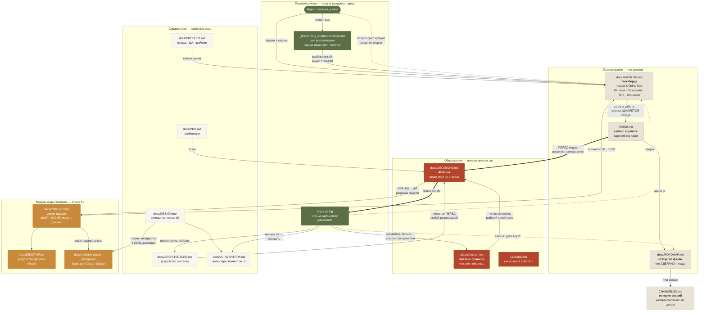

# Как устроена документация Cedar Clerk

Схема потоков между документами: кто первоисточник, что куда переносится и в какой момент. Существует, чтобы не повторялся рассинхрон — когда BACKLOG считает фичу открытой, ROADMAP «не начатой», а в коде она с прошлой недели.

## Схема

## Первоисточники (истина рождается только здесь)

| Источник | Что в нём | Важное |
|---|---|---|
| **Марти** | Все хотелки и приоритеты | Единственный источник целей. Вопросы к нему копятся в BACKLOG как `Q-xx` |
| **`_Documents_/CedarClerk/Input.md`** | Сырой ввод: идеи, баги, улучшения | **Вне репозитория.** Марти периодически ПЕРЕЗАПИСЫВАЕТ файл с нуля — это добавление, а не отмена прошлого. Проверять mtime: свежее последней «Input sweep» в ROADMAP = есть неразобранное |
| **Код + `git log`** | Что реально работает | **Главный арбитр.** Если док и код расходятся — прав код, док чинится |

## Планирование

**`docs/BACKLOG.md` — таск-борда.** Только открытое. Формат: `ID · Имя · Приоритет · Теги · Описание`, ID стабильные (`T-xxx` задачи, `Q-xx` вопросы), исходные номера Марти (B*, N*, I*, NF*, FI*) — в скобках в описании. **Сделанные строки удаляются**, не вычёркиваются: история живёт в git, а борда должна читаться за минуту.

**`docs/ROADMAP.md` — статус по фазам.** Что сделано, когда и с каким сознательным сокращением скоупа. Растёт вниз, ничего не удаляется.

**`TASKS.md` — короткий горизонт.** Что прямо сейчас в работе + чек-лист «не проверено вживую». Самый быстро протухающий файл.

**`CHANGELOG.md` — по датам, человекочитаемо.** Пишется в конце сессии.

## Обоснования

**`docs/DECISIONS.md` (ADR-лог)** — жёсткое правило из CLAUDE.md: **меняешь решение → сначала ADR, потом код.** Отменённые решения не стираются, а перекрываются новым ADR (например ADR-065 исправляет ADR-064) — видно не только «как есть», но и «как думали раньше и почему передумали».

**`.claude/rules/*.md`** — то, что уже больно ломалось: Telegram-бот, EF-миграции, рендереры, деструктивные операции, секреты, прод. Читаются **перед** работой в зоне.

## Три правила против рассинхрона

1. **Задача живёт ровно в одном месте.** Открыта → BACKLOG. Взяли → TASKS. Сделали → ROADMAP + CHANGELOG, из BACKLOG **удалить**.
2. **Перед реализацией — ARCHITECTURE и PRD; при смене решения — сперва DECISIONS.**
3. **Не доверять доку про статус — сверить с кодом.** Так нашлись: админ-панель, месяцами числившаяся «не начатой» при готовности с 27.07; `I15`, закрытый, но висевший открытым; `N6`/`N11`, сделанные до того, как их завели.

## Модуль инди-геймдева (Phase 13, с 10.08.2026)

Три новых документа не меняют правила выше, а занимают в них конкретные места:

- **`docs/INDIEDEV.md`** — справочник по модулю: скоуп, модель данных, MUST/MIGHT. Читается **перед** реализацией любой строки `T-120…T-137`, ровно как `ARCHITECTURE.md` и `PRD.md` по правилу 2.
- **`docs/DESKTOP.md`** — устройство десктоп-сборки. Отдельный файл, а не раздел `ARCHITECTURE.md`, потому что описывает вторую среду исполнения со своими рисками; `ARCHITECTURE.md` ссылается на него.
- **`docs/indiedev-design-prompt.md`** — бриф для Claude Design. Односторонний потребитель: токены копируются в него из `DESIGN.md` дословно, обратно ничего не течёт. **Значит он протухает молча** — при изменении `styles.scss` сверять перед запуском.

Правило «задача живёт ровно в одном месте» действует и здесь: MUST/MIGHT-списки в `INDIEDEV.md` — это *состав* модуля, а строки задач живут в `BACKLOG.md`. Список в `INDIEDEV.md` не вычёркивается по мере работы — статус ведёт `ROADMAP.md`.

## Известные слабые места

- ~~**`docs/PRD.md` устарел**~~ — **починено 10.08.2026**: раздел про языки переписан на шесть языков с per-draft основным (ADR-064/065). Отставание держалось около двух недель после смены модели.
- **`docs/UI-INVENTORY.md`** обновляется вручную и отстаёт сильнее прочих. Экраны модуля в нём ещё не заведены.
- **`Input.md` вне репозитория** — не виден в git-истории; момент перезаписи восстанавливается только по mtime. То же и с брифом `Gamedev_Focused_Rework.md`, который лежит рядом с ним и породил Phase 13.
- **`docs/indiedev-design-prompt.md` дублирует токены** — сознательно (бриф должен копироваться целиком), но это второй экземпляр значений, и он не проверяется ничем.

## `docs/migration-to-digitalocean.md` (11.08.2026)

Чек-лист переезда прода с Raspberry Pi на DigitalOcean, снятый с фактического состояния машины. **Выполнен 11.08.2026** — и с этого дня файл читается как журнал переезда, а не как план. Источник истины о проде — `.claude/rules/production-environment.md`: он переписан по факту в тот же день, вместе с упоминаниями Pi в правилах, `ARCHITECTURE.md`, `CLAUDE.md` и скриптах. `CHANGELOG.md` и `DECISIONS.md` при этом **не** правились: там записано, как было тогда.
